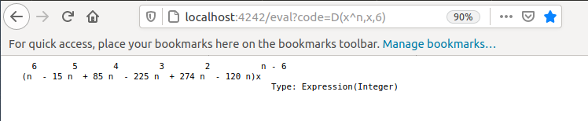

# fricas_http :construction: :rocket:
FriCAS HTTP Server/Client (cl-hunchentoot/cl-drakma)

## Prerequisites

 * [FriCAS](http://fricas.sourceforge.net/)
 * [ASDF](http://common-lisp.net/project/asdf/) (`sudo apt install cl-asdf`)
 * [Hunchentoot](http://weitz.de/hunchentoot/) (`sudo apt install cl-hunchentoot`)
 * [Drakma](https://edicl.github.io/drakma/) (`sudo apt install cl-drakma`)
 
For other Linux distros you may use the adequate install tool.

## Installation
None, but you have to compile the files. 

``` 
  )compile httpcli
  )compile httpsrv
```

## Test Server

```
  )compile httpsrv

  ; compilation finished in 0:00:00.026
------------------------------------------------------------------------
   HttpServer is now explicitly exposed in frame initial 
   HttpServer will be automatically loaded when needed from 
      /home/kfp/devel/fricas_http/HTTPSRV.NRLIB/HTTPSRV

  (2) -> start 4242

  Value = ("uiop" "UIOP" "asdf" "ASDF")
  Value = ("SB-ROTATE-BYTE" "SB-BSD-SOCKETS")
  Value = |htStart|

   (2)  #<EASY-ACCEPTOR (host *, port 4242)>
                                                            Type: SExpression

```

Open ``http://localhost:4242/`` in a web-browser, then you should see:


The next URL will evaluate the sixth derivative of ``x^n``:

```
  http://localhost:4242/eval?code=D(x^n,x,6)
```




## Test Client

```
  )compile httpcli
  
  ; compilation finished in 0:00:00.044
------------------------------------------------------------------------
   HttpClient is now explicitly exposed in frame initial 
   HttpClient will be automatically loaded when needed from 
      /home/kfp/devel/fricas_http/HTTPCLI.NRLIB/HTTPCLI

  (1) -> r:=GET "https://raw.githubusercontent.com/fricas/fricas/master/README"

  Value = ("uiop" "UIOP" "asdf" "ASDF")
  Value = ("URI" "SB-BSD-SOCKETS")
  Value = |drakmaGET|
  Value = |drakmaPOST|

   (1)
  "This is FriCAS computer algebra system.  FriCAS is a fork of Axiom.
   For installation instructions see INSTALL. 
   ...
   -- add new mathematical algorithms

   Waldek Hebisch
   "
                                                            Type: SExpression
  "
  
  -- convert to type String if you like: string r 
  
```


 

