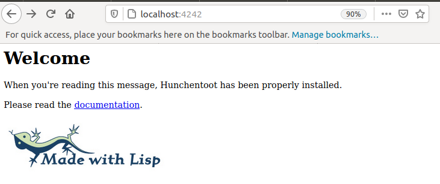

# fricas_http :construction: :rocket:
FriCAS HTTP Server/Client (cl-hunchentoot/cl-drakma)

## Prerequisites

 * [FriCAS](http://fricas.sourceforge.net/)
 * [ASDF](http://common-lisp.net/project/asdf/) (`sudo apt install cl-asdf`)
 * [Hunchentoot](http://weitz.de/hunchentoot/) (`sudo apt install cl-hunchentoot`)
 * [Drakma](https://edicl.github.io/drakma/) (`sudo apt install cl-drakma`)
 
For other Linux distros you may use the adequate install tool.

## Installation
None, but you have to compile the files. 

``` 
  )compile httpcli
  )compile httpsrv
```

## Test Server

```
  )compile httpsrv

  ; compilation finished in 0:00:00.026
------------------------------------------------------------------------
   HttpServer is now explicitly exposed in frame initial 
   HttpServer will be automatically loaded when needed from 
      /home/kfp/devel/fricas_http/HTTPSRV.NRLIB/HTTPSRV

  (2) -> start 4242

  Value = ("uiop" "UIOP" "asdf" "ASDF")
  Value = ("SB-ROTATE-BYTE" "SB-BSD-SOCKETS")
  Value = |htStart|

   (2)  #<EASY-ACCEPTOR (host *, port 4242)>
                                                            Type: SExpression

```

Open ``http://localhost:4242/`` in a web-browser:

```
  (3) -> 127.0.0.1 - [2021-04-12 22:24:25] "GET / HTTP/1.1" 200 393 "-" 
  "Mozilla/5.0 (X11; Ubuntu; Linux x86_64; rv:87.0) Gecko/20100101 Firefox/87.0"
   127.0.0.1 - [2021-04-12 22:24:26] "GET /img/made-with-lisp-logo.jpg 
   HTTP/1.1" 200 12583 "http://localhost:4242/" "Mozilla/5.0 (X11; Ubuntu; 
   Linux x86_64; rv:87.0) Gecko/20100101 Firefox/87.0"
   127.0.0.1 - [2021-04-12 22:24:26] "GET /favicon.ico HTTP/1.1" 200 1406 
   "http://localhost:4242/" "Mozilla/5.0 (X11; Ubuntu; Linux x86_64; rv:87.0) 
   Gecko/20100101 Firefox/87.0"
```
  
  
then you should see:




## Test

 * `http://localhost:4242/eval?code=D(x^n,x,2)`
 * `http://localhost:4242/json?code=D(x^n,x,3)`


 

